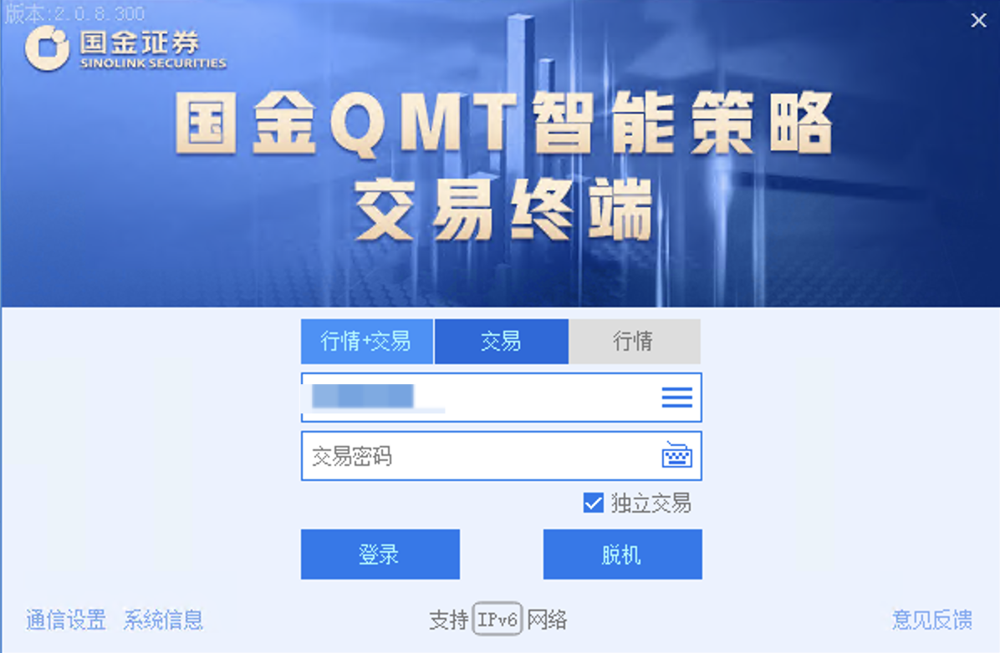
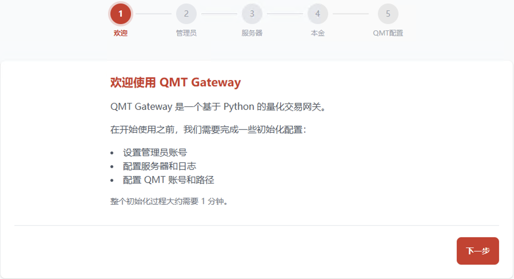

# 匡醍 QMT 交易网关

> 一个独立的 Windows 网关服务，封装 [QMT（迅投量化交易终端）](https://www.thinktrader.net/) 的 `xtquant` SDK，将交易、行情等功能以 HTTP / WebSocket API 的形式对外暴露。策略程序可以在任意平台运行，无需依赖 QMT 自带的 Python 环境。


## 功能概览

- **交易 API** — 买入、卖出、撤单，查询委托、成交、持仓、资产
- **实时行情** — WebSocket（`/ws/quotes`）推送合成后的 K 线数据（1 分钟、30 分钟、日线）
- **集合竞价行情** — 独立 WebSocket（`/ws/auction`）推送 09:15–09:30 原始撮合 tick
- **历史数据下载** — 按板块 / 日期下载分钟线 Parquet 文件
- **Web 交易台** — 内置交易界面，含下单表单、速拨盘、持仓 / 委托表格、日志查看器、数据管理
- **初始化向导** — 首次运行逐步引导 QMT 路径、账户、密码、服务器配置
- **自动启动 QMT** — 可选在网关启动时自动拉起 QMT 并填入交易密码，密码加密存储
- **API Key 鉴权** — Web 端使用 session 登录；对外程序化访问使用 `X-API-Key` 长令牌
- **在线更新与回滚** — 从 Web UI 检查版本、一键更新、一键回滚
- **系统托盘图标** — 任务栏右下角"匡"字图标，右键菜单控制一切（打开界面、重启、停止）

## 环境要求

| 依赖     | 说明                        |
| -------- | --------------------------- |
| 操作系统 | Windows 10 / 11（64 位）    |
| QMT      | 安装在本机，已完成授权      |
| xtquant  | 通过配置的 QMT 路径自动加载 |

安装程序自带嵌入式 Python 3.13，不需要自己装 Python。

## 安装

### 前置安装

你需要首先安装 QMT 客户端。目前经过测试的客户端是国金版本的。其它客户端因为本质上都是由迅投开发的 QMT，原则上应该兼容，但因为没有其它家的账户，所以无法测试。



然后你还需要在[迅投官网](https://dict.thinktrader.net/nativeApi/download_xtquant.html?id=7zqjlm)下载Xtquant SDK，并解压到任意目录。之后在安装设置 qmt-gateway 时，需要提供该目录地址。

### 一、Windows 安装程序（**唯一受支持的方式**）

从 [Releases](https://github.com/zillionare/qmt-gateway/releases) 页面下载最新的 `QMT-Gateway-Setup-x.y.z-buildNN.exe`，双击运行。

安装程序会自动完成：

1. 解压嵌入式 Python 3.13
2. 引导安装全部 Python 依赖
3. 添加 Windows 防火墙入站规则（端口 8130–8139）
4. 注册开机自启计划任务
5. 写入开始菜单快捷方式
6. 启动 QMT Gateway 与系统托盘

> **注意**：本项目不再支持 `git clone` + 手动 `pip install` 的安装方式。所有 Python 依赖版本、嵌入式解释器路径、计划任务注册都已绑定到安装器流程。开发人员请参考 `docs/dev-setup.md`（待补充）。

### 二、首次配置

安装完成后，会自动打开浏览器到 `http://localhost:8130`，进入初始化向导：
 


1. **QMT 路径** — 指定 QMT 客户端安装目录
2. **管理员账号** — 设置 Web 管理界面的登录密码
3. **QMT 交易密码**（可选）— 用于自动启动 QMT 时填入密码
4. **自动启动**（可选）— 网关启动时自动拉起 QMT 并完成登录

## 日常使用

### 托盘图标

安装完成后，**系统托盘**（任务栏右下角通知区）会出现一个红色"匡"字图标。

> ⚠️ 如果托盘图标不可见：点击任务栏的"∧"展开按钮找到"匡醍 QMT 交易网关"。

**右键菜单：**

| 菜单项               | 作用                                                                          |
| -------------------- | ----------------------------------------------------------------------------- |
| **打开管理界面**     | 浏览器打开当前网关的 Web UI（自动用实际端口，即使 8130 被占用跳到 8131 也对） |
| **重启 QMT Gateway** | 终止当前网关进程，等待端口空闲，再启动新的                                    |
| **停止 QMT Gateway** | 终止网关进程（托盘自身保留——选"退出托盘"才关托盘）                            |
| **退出托盘**         | 关闭托盘程序；网关继续运行                                                    |

**双击托盘** = 打开管理界面（同"打开管理界面"）。

### 开机自启

安装时默认启用。任务计划程序里任务名为 `QMT Gateway`，触发条件是"用户登录时"。要禁用：

- 控制面板 → 管理工具 → 任务计划程序 → 找到 `QMT Gateway` → 禁用；或
- Web UI → 系统管理 → 自动启动 → 切换

### 完全卸载

开始菜单 → "卸载"，或控制面板 → 程序与功能 → "匡醍 QMT 交易网关" → 卸载。卸载时可选保留或删除 `~/.qmt-gateway` 数据目录。

## 配置

### 数据目录

默认 `C:\Users\<你>\.qmt-gateway\`。所有持久化数据：

```
~/.qmt-gateway/
├── data/
│   └── app.db          # SQLite（配置、委托、持仓、资产）
├── log/
│   └── qmt-gateway.log # 应用日志（自动轮转，每份 10 MB）
├── .lock               # 单实例锁（PID）
├── .port               # 当前实际监听端口（gateway 写，托盘读）
└── exports/            # 历史数据导出文件
```

### 命令行参数

管理员 PowerShell 下：
```powershell
& "C:\Program Files\quantide-gateway\python\python.exe" `
    -m qmt_gateway `
    --host 0.0.0.0 `
    --port 8130 `
    --home "C:\Users\you\.qmt-gateway"
```

| 参数            | 说明                                     |
| --------------- | ---------------------------------------- |
| `--host`        | 监听地址（默认 `0.0.0.0`）               |
| `--port`        | 端口（默认 8130，被占用则自动跳到 8131） |
| `--home`        | 数据主目录                               |
| `--init-wizard` | 显示初始化向导                           |
| `--force`       | 强制重新初始化（配合 `--init-wizard`）   |

### 环境变量

| 变量               | 默认值           | 说明         |
| ------------------ | ---------------- | ------------ |
| `QMT_GATEWAY_HOST` | `0.0.0.0`        | 服务监听地址 |
| `QMT_GATEWAY_PORT` | `8130`           | 服务端口     |
| `QMT_GATEWAY_HOME` | `~/.qmt-gateway` | 数据主目录   |

## API 参考

所有 API 端点均需认证——浏览器 session 或 `X-API-Key` 请求头二选一。

### 认证

| 方法     | 端点                     | 说明              |
| -------- | ------------------------ | ----------------- |
| `GET`    | `/login`                 | 登录页面          |
| `POST`   | `/auth/login`            | 用户名 + 密码登录 |
| `GET`    | `/auth/logout`           | 登出              |
| `POST`   | `/api/api-keys`          | 创建 API Key      |
| `GET`    | `/api/api-keys`          | 列出所有 API Key  |
| `DELETE` | `/api/api-keys/{key_id}` | 吊销 API Key      |

程序化访问示例：
```bash
curl -H "X-API-Key: qmt_abc123..." http://localhost:8130/api/trade/asset
```

### 交易

| 方法   | 端点                           | 说明                |
| ------ | ------------------------------ | ------------------- |
| `GET`  | `/api/trade/asset`             | 账户资产            |
| `GET`  | `/api/trade/positions`         | 当前持仓            |
| `GET`  | `/api/trade/orders`            | 当日委托            |
| `GET`  | `/api/trade/trades`            | 当日成交            |
| `POST` | `/api/trade/buy`               | 买入                |
| `POST` | `/api/trade/sell`              | 卖出                |
| `POST` | `/api/trade/cancel`            | 按 qtoid 撤单       |
| `GET`  | `/api/trade/connection-status` | QMT 连接状态        |
| `POST` | `/api/trade/restart-qmt`       | 重启 QMT 并自动登录 |
| `POST` | `/api/asset/principal`         | 修改本金            |

买入示例：
```bash
curl -X POST "http://localhost:8130/api/trade/buy" \
  -H "X-API-Key: qmt_..." \
  -d "symbol=000001.SZ&price=12.50&shares=100"
```

### 行情 WebSocket — `ws://host:port/ws/quotes`

```json
{
  "symbol": "000001.SZ",
  "interval": 60,
  "ts": 1717387200,
  "open": 12.30,
  "high": 12.55,
  "low": 12.28,
  "close": 12.50,
  "volume": 150000,
  "amount": 1867500.0
}
```

`interval`：`60`（1 分钟）、`1800`（30 分钟）、`86400`（日线）。

### 集合竞价 — `ws://host:port/ws/auction`

09:15–09:30 推送原始撮合 tick：

```json
{
  "type": "auction",
  "symbol": "000001.SZ",
  "phase": "auction_b",
  "price": 12.34,
  "open": 0.0,
  "volume": 0,
  "server_time": "2026-06-12T09:23:45.000"
}
```

### 股票

| 方法  | 端点                                       | 说明                 |
| ----- | ------------------------------------------ | -------------------- |
| `GET` | `/api/stocks`                              | 全部股票列表         |
| `GET` | `/api/stocks/search?stock_search=<关键词>` | 按代码/名称/拼音搜索 |
| `GET` | `/api/stock/info?symbol=<代码>`            | 股票信息 + 昨收价    |
| `GET` | `/api/stock/resolve?q=<关键词>`            | 关键词解析为股票代码 |

### 历史数据

| 方法   | 端点                                      | 说明               |
| ------ | ----------------------------------------- | ------------------ |
| `POST` | `/api/history/minutes/jobs`               | 创建分钟线下载任务 |
| `GET`  | `/api/history/minutes/jobs/{job_id}`      | 查询任务状态       |
| `GET`  | `/api/history/minutes/jobs/{job_id}/file` | 下载 Parquet 文件  |

### 系统管理

| 方法   | 端点                    | 说明           |
| ------ | ----------------------- | -------------- |
| `GET`  | `/api/ping`             | 健康检查       |
| `GET`  | `/api/system/version`   | 版本信息       |
| `POST` | `/api/system/update`    | 自动更新       |
| `GET`  | `/api/system/autostart` | 自启状态       |
| `POST` | `/api/system/autostart` | 启用/禁用自启  |
| `GET`  | `/api/system/firewall`  | 防火墙规则状态 |
| `POST` | `/api/system/firewall`  | 防火墙规则     |

### 日志

| 方法  | 端点           | 说明         |
| ----- | -------------- | ------------ |
| `GET` | `/logs/stream` | SSE 实时日志 |

## 架构

```
┌──────────────────────────────────────────────────┐
│              qmt-gateway (Windows)                │
│                                                   │
│  ┌──────────┐  ┌───────────┐  ┌──────────────┐  │
│  │ REST API │  │ WebSocket │  │   Web UI      │  │
│  │ (交易,   │  │ (行情,    │  │ (FastHTML +   │  │
│  │  股票,   │  │  竞价)    │  │   HTMX)       │  │
│  │  系统)   │  │           │  │               │  │
│  └────┬─────┘  └─────┬─────┘  └──────┬───────┘  │
│       │              │               │            │
│  ┌────┴──────────────┴───────────────┴──────┐    │
│  │              服务层                        │    │
│  │  TradeService · QuoteService · StockService│   │
│  │  HistoryDownloadService · Scheduler       │    │
│  └────────────────┬──────────────────────────┘    │
│                   │                                │
│  ┌────────────────┴─────────────────────────┐     │
│  │   托盘进程（独立）· xtquant (xttrader)    │     │
│  └────────────────┬─────────────────────────┘     │
└───────────────────┼───────────────────────────────┘
                    │
              ┌─────┴──────┐
              │  QMT 客户端 │
              │ (XtMiniQmt) │
              └─────────────┘
```

**技术栈：** Python 3.13 · FastHTML · Starlette · uvicorn · SQLite · orjson · pywinauto · pystray · bcrypt · cryptography

## 常见问题

**Q：托盘图标不见了？**
A：任务栏右下角点"∧"展开所有图标，找"匡醍 QMT 交易网关"。可以右键它 → 锁定到任务栏。

**Q：网关启动了但浏览器打不开？**
A：右键托盘 → "打开管理界面"——托盘自动读 `.port` 文件拿到实际端口，不会被 8130 占用困扰。

**Q：怎么知道当前实际端口？**
A：看托盘菜单的标题，或者 `%USERPROFILE%\.qmt-gateway\.port`。

**Q：完全卸载后会留下什么？**
A：可选删除 `~/.qmt-gateway` 数据目录。计划任务、防火墙规则、注册表项都会清理。

## License

本项目为私有项目，详见 [LICENSE](LICENSE)。
